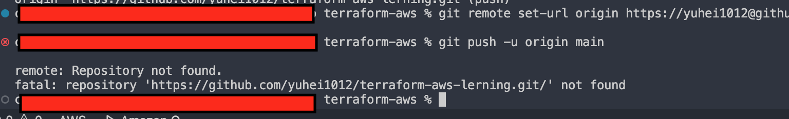
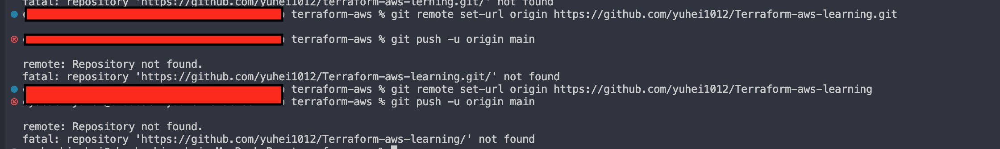
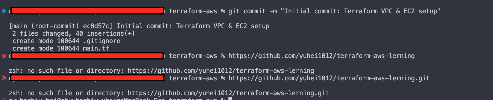
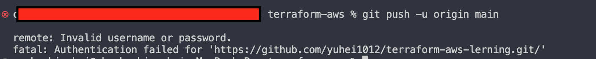

GitHubでの作業記録（Gitのトラブルシューティングと手順）

✅ Gitで行った作業とトラブルシューティング

📌 1️⃣ Gitリポジトリの初期化

git init

✅ 新しいリポジトリを作成し、Git管理を開始する

📌 2️⃣ .gitignore の作成（不要ファイルを除外）

echo ".terraform/" >> .gitignore
echo "terraform.tfstate*" >> .gitignore
echo "*.tfstate.backup" >> .gitignore

✅ Terraformの状態管理ファイルをGit管理から除外する

📌 3️⃣ 変更をステージング

git add .

✅ すべてのファイルをステージに追加

📌 4️⃣ 最初のコミット

git commit -m "Initial commit"

✅ 変更をGitに記録

📌 5️⃣ GitHubリポジトリの作成とリモート設定

git remote add origin https://github.com/yourname/repo.git
git branch -M main
git push -u origin main

✅ GitHubにリポジトリを作成し、リモートを設定後、プッシュ

🚨 トラブルシューティング

❌ Repository not found エラー

GitHubにリポジトリを作成していなかった↓

リポジトリー名間違い↓

リポジトリー名間違い2↓

原因: GitHubにリポジトリを作成していなかった / URLが間違っていた

対処法: GitHubでリポジトリを作成し、URLを確認して git remote set-url で修正

❌ Invalid username or password エラー

原因: HTTPS経由の認証にはPersonal Access Tokenが必要

対処法: GitHubの「Developer Settings」→「Personal Access Tokens」からトークンを発行し、パスワードの代わりに使用

❌ fatal: remote origin already exists エラー

原因: git remote add origin を2回実行していた

対処法: git remote remove origin を実行し、正しいURLで再設定
