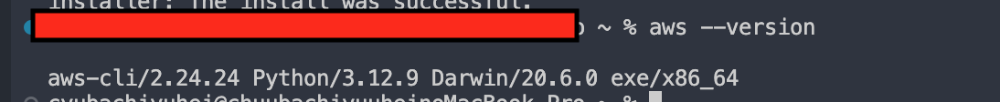
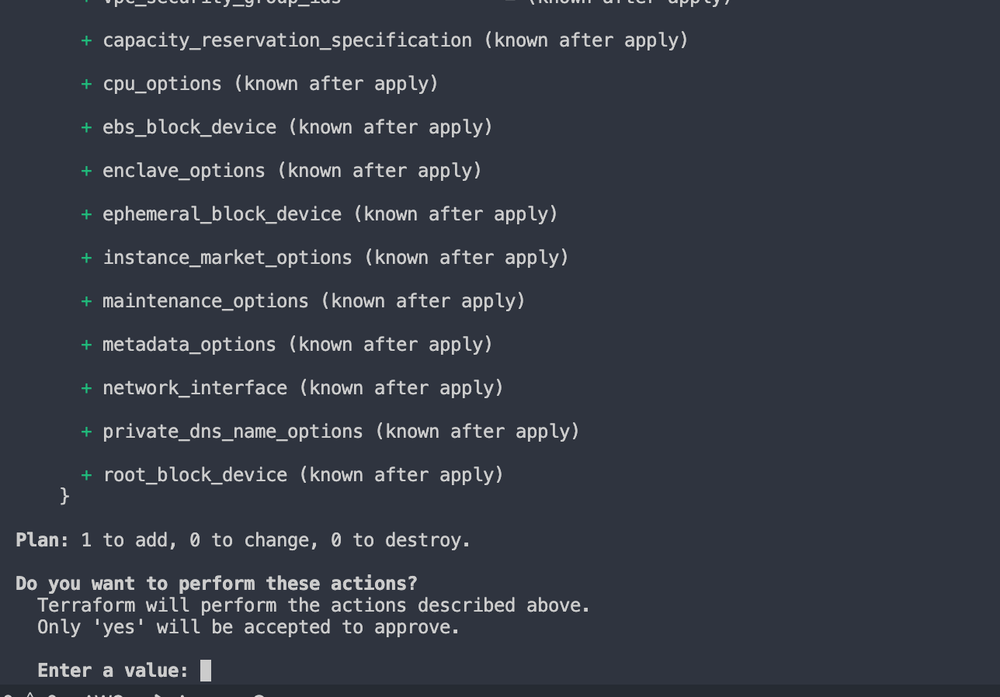
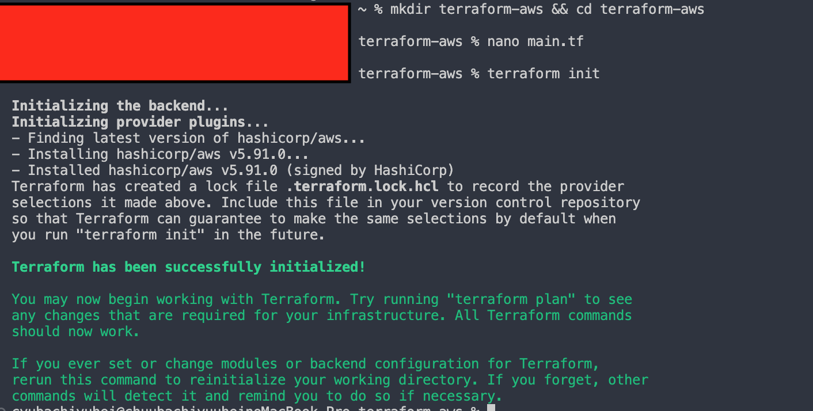
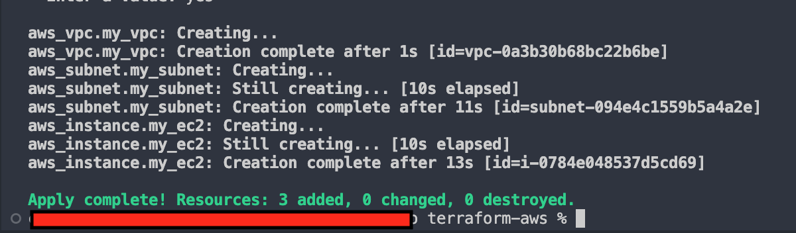
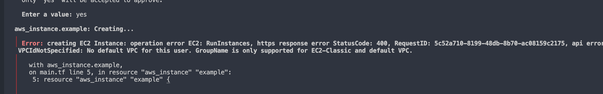

1. Terraformのインストール

Terraformを使うには、まずTerraform本体をインストールする必要があります。
環境（Mac / Windows）によってインストール方法が異なるので、それぞれ解説します。

✅ MacでのTerraformインストール

Macでは、次の2つの方法があります。

📌 1️⃣ Homebrew を使う方法（簡単・管理しやすい）

brew tap hashicorp/tap
brew install hashicorp/tap/terraform

✅ インストール確認

terraform -version

✅ メリット

brew upgrade terraform で簡単にアップデート可能

brew uninstall terraform で削除も簡単

❌ デメリット

遅いことがある（実際に試したら時間がかかった）

Homebrewが必要（MacにHomebrewが入っていない場合は別途インストールが必要）

📌 2️⃣ 公式サイトからインストール（手動）

curl -o terraform.zip https://releases.hashicorp.com/terraform/1.11.2/terraform_1.11.2_darwin_amd64.zip
unzip terraform.zip
sudo mv terraform /usr/local/bin/

✅ インストール確認

terraform -version

✅ メリット

最新バージョンをすぐにインストールできる

Homebrewなしでインストール可能

Homebrewより速い（実際に試して速かった！）

❌ デメリット

手動で更新が必要（新しいバージョンが出たら再インストールが必要）

✅ WindowsでのTerraformインストール

Windowsでも、次の2つの方法があります。

📌 1️⃣ 公式サイトからインストール

Terraform公式サイト からWindows用のZIPをダウンロード

ZIPを展開し、terraform.exe を C:\Program Files\Terraform\ に移動

C:\Program Files\Terraform\ を 環境変数 PATH に追加

コマンドプロンプトで terraform -version を実行し、インストール確認

📌 2️⃣ WSL（Ubuntu）を使う

sudo apt update && sudo apt install -y terraform
terraform -version

✅ Macと同じ方法で管理できるので、統一感が出る！

2. AWS CLI のインストール

TerraformでAWSを操作するには、AWS CLIが必要です。
AWS CLIは、AWSとやり取りするためのコマンドラインツールです。

✅ MacでのAWS CLIインストール

📌 1️⃣ Homebrewでインストール

brew install awscli
aws --version

✅ メリット

brew upgrade awscli で簡単にアップデート可能

brew uninstall awscli で削除も簡単

❌ デメリット

遅い（試してみたら時間がかかった）

📌 2️⃣ 公式サイトからインストール（速い！）

curl "https://awscli.amazonaws.com/AWSCLIV2.pkg" -o "AWSCLIV2.pkg"
sudo installer -pkg AWSCLIV2.pkg -target /
aws --version
rm AWSCLIV2.pkg  # （不要なら削除）

✅ メリット

Homebrewより速い

Homebrewなしでインストール可能

❌ デメリット

手動で更新が必要（新しいバージョンが出たら再インストール）

✅ WindowsでのAWS CLIインストール

AWS CLI公式サイト からWindows用のインストーラーをダウンロード

.msi ファイルを実行してインストール

コマンドプロンプトで aws --version を実行し、インストール確認

3. Terraformで .tf ファイルを作成

Terraformの設定ファイル .tf を作成してAWSリソースを管理します。

#### aws-cliインストール後

📌 1️⃣ Terraformの作業ディレクトリを作成

mkdir terraform-aws

cd terraform-aws

✅ 作業ディレクトリを作成し、移動する

📌 2️⃣ main.tf を作成

touch main.tf

vim main.tf

✅ 空の main.tf を作成し、編集する

📌 3️⃣ main.tf にAWSリソースを記述

provider "aws" {
  region = "ap-northeast-1"
}

resource "aws_vpc" "my_vpc" {
  cidr_block = "10.0.0.0/16"  # 大規模ネットワークを確保
}

resource "aws_subnet" "my_subnet" {
  vpc_id     = aws_vpc.my_vpc.id
  cidr_block = "10.0.1.0/24"  # 256IPアドレスのサブネット
}

resource "aws_instance" "my_ec2" {
  ami           = "ami-0c3fd0f5d33134a76"
  instance_type = "t2.micro"
  subnet_id     = aws_subnet.my_subnet.id
}

✅ VPCは10.0.0.0/16にして、将来の拡張性を考慮

✅ サブネットは10.0.1.0/24にして、適切なIP範囲を確保

✅ EC2はAmazon Linux 2で構築し、サブネット内に配置

4. Terraformの実行

####  実行前にリソース確認

AWS上にTerraformでインフラを自動構築します。
問題なければyesを入力する。
enterやyでは作成されない。

#### tfファイル作成・実行成功

📌 使用したコマンド

terraform init   # 初期化

terraform plan   # 変更内容を確認

terraform apply  # AWSにリソースを作成

terraform destroy  # 削除

#### リソース作成成功 VPC,subnet,ec2

#### リソース作成失敗

この時はVPCがないのにec2を作成しようとしたため
🔥 まとめ

✅ Terraform & AWS CLIのインストール方法を整理！

✅ Terraformで .tf ファイルを作成する手順を理解！

✅ リソースの詳細な説明を加え、ネットワーク設計の意図を明確化！
